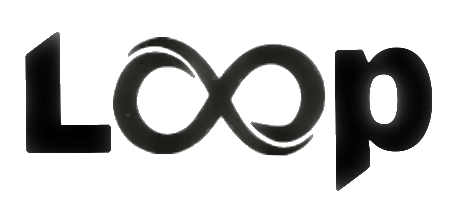

# Loop Project File Documentation {#mainpage}

<!-- TOC seems to break alignment (also note that if TOC is enabled you MUST use level 1 headers) -->
<!-- [TOC] -->

<!-- I would prefer to have an image linked to the loop project website but Doxygen markdown cannot do this -->
<!-- In Doxygen 1.8.16 (released 9/8/2019) it might be possible -->

[Loop Project Website](https://loop3d.org)

# What is Loop?
The Loop platform is an open source 3D probabilistic geological and geophysical modelling platform, initiated by Geoscience Australia and the OneGeology consortium. The project is funded by Australian territory, State and Federal Geological Surveys, the Australian Research Council and the MinEx Collaborative Research Centre.

# What is a Loop Project File?
A Loop Project File encapsulates all the data and models used or created in a Loop workflow.  This includes the ability to create meta-data which provides provenance of the data and the methodology and history of how models are used and produced.  The Loop Project File is based on netCDF and has APIs for C/C++, Python and Fortran.
- [Loop Project File - C/C++](https://github.com/Loop3D/LoopProjectFile-cpp)
- [Loop Project File - Python](https://github.com/Loop3D/LoopProjectFile)
- [Loop Project File - Fortran](https://github.com/Loop3D/LoopProjectFile-fortran)

# Why use a project file?
There are several benefits to using a single project file.  These include encapsulating the information in a single place, server storage and retrieval enabling batching of model creation over multiple servers, easily shared workflows, and storage efficiency among many more.

# Why use netCDF?
netCDF enables multi-dimensional data structure storage in a highly compressed format as well as data attribution for meta-data all within a single data file.

# Licencing
The Loop Project File C/C++ repository is under the MIT license 

